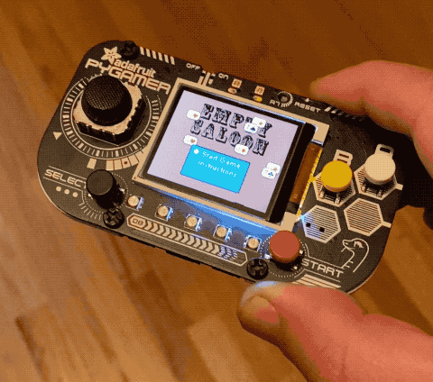
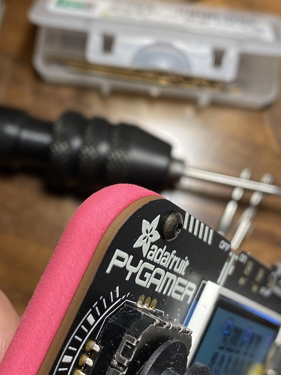
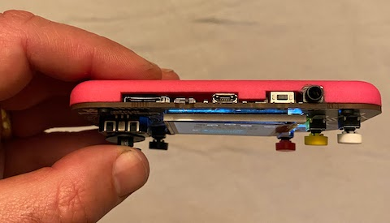
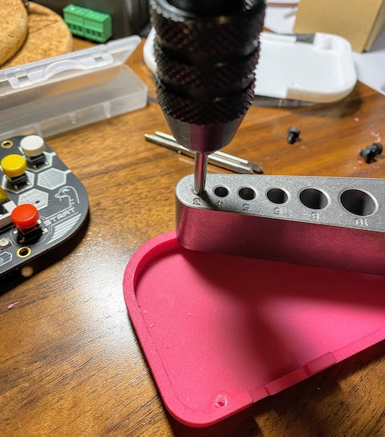

# pygamer-case

The [Adafruit PyGamer](https://www.adafruit.com/product/4242) is a small $45 gaming handheld for DIY development in CircuitPython, MakeCode Arcade or Arduino, sold as a PCB without enclosure.

I bought one, and while there's an option for a lasercut case, I didn't love how the bolts/nults stick out of the back, and I like the look of the exposed PCB front, so I experimented with a few quick 3D printed case options to hold it and the optional battery and speaker. I posted an image on twitter and a few people asked me if I would share the STL, so this is a tiny repo just for that (**pygamer_back_v4.stl** in the list above is the most recent design).

## Fabrication

I made it using SLS (selective laser sintered) Nylon, which has nice resolution and a somewhat chalky texture that feels nice in the hand, though you could add a bead blasted / 'media tumbled' finish if you like it a bit smoother. It should be ~$20-$30 at typical 3D print shops. The shop I used for the first print is Xometry (note: if you join with [this link](https://mbsy.co/3qpWPJ) we both get some account credit, likely enought to print this for free), but many shops provide SLS these days.

v1 was assembled with M3x4mm nylon screws carefully tapped directly into the slightly-undersized holes in the 3D print, which is not advised if you want to be able to open and close it many times as it's easy to destroy the threads doing this... 

For the current version I reduced the hole size for M2.5 fasteners since I own that tap, and tapped directly into the 3D printed plastic (with tap guide to help keep it straight), and used M2.5x6mm black oxide button head screws for a sleek look.

Side note: using [brass heat-set inserts](https://www.adafruit.com/product/4256) is a more robust way to use threaded fasteners in plastic parts where you need to insert and remove screws many times, but because the holes in this PCB are so close to the edge I wasn't sure I'd have enough plastic to support those.
