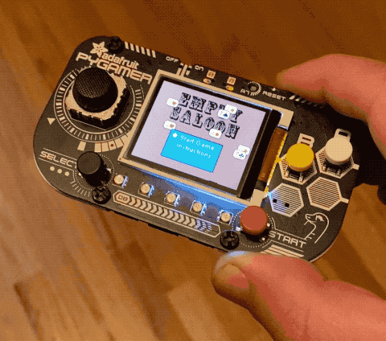

# pygamer-case

The [Adafruit PyGamer](https://www.adafruit.com/product/4242) is a small $45 gaming handheld for DIY development, sold as a PCB without enclosure.

I bought one, and while there's an option for a lasercut case, I didn't love how the bolts/nults stick out of the back, and I like the look of the exposed PCB front, so I'm experimenting with a few 3D printed or machined case options to hold it and the optional battery and speaker. I posted an image on twitter and a few people asked me if I would share the STL, so this is a tiny repo just for that.

The current case works, but because this was a quick one-evening design after measuring the PCB by hand (I wasn't sure if the PCB layout files were published by Adafruit), the fit around the connectors is off. I'm printing a second version now and will update this if it fits well.

## Fabrication

I made it out of SLS (selective laser sintered) Nylon, which has nice resolution and a somewhat chalky texture that feels nice in the hand, though you could add a bead blasted / 'media tumbled' finish if you like it a bit smoother. It should be ~$20-$30 at typical 3D print shops.

This first version is assembled with M3x4mm nylon screws carefully tapped directly into the 3D print(!), which is not advised if you want to be able to open and close it many times. I'm going to look at using an actual steel tap in the next version, or fastening with spring tabs instead.
